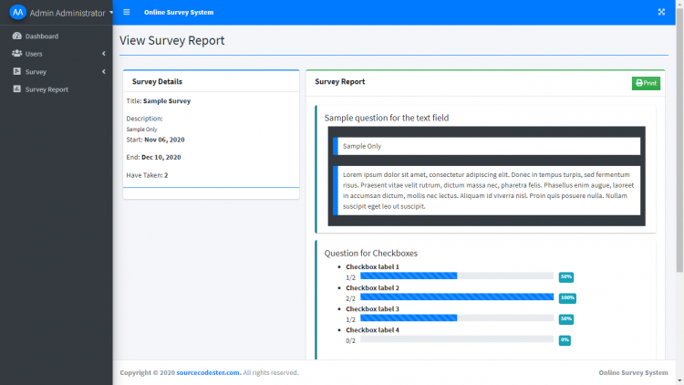

# Simple Online Survey System using PHP/MySQLi

  

### Description

The Online Survey System is a simple project that can help a certain school, company or any organization that conducting surveys within its circle. The system has 2 types of users which is the admin and subscribers/users.

### Features

<ul>
  <li>Login</li>
  <li>Dashboard</li>
  <li>Manage Survey</li>
  <li>Mange Survey Form</li>
  <li>Manage Users</li>
  <li>Generate Report</li>
</ul>

Visit [sourcecodester.com](https://www.sourcecodester.com/php/14590/simple-online-survey-system-using-phpmysqli-source-code.html) for more detailed information about this Simple Online Survey System Project in PHP/MySQLi.

### Website Info

| Title | Simple Online Survey System using PHP/MySQLi with Source Code |
|:--|:--|
| Website | [www.sourcecodester.com](https://www.sourcecodester.com) |
| Link | https://www.sourcecodester.com/php/14590/simple-online-survey-system-using-phpmysqli-source-code.html |
| Language | PHP |
| Uploader/Developer | [oretnom23](https://www.sourcecodester.com/users/tips23) |
